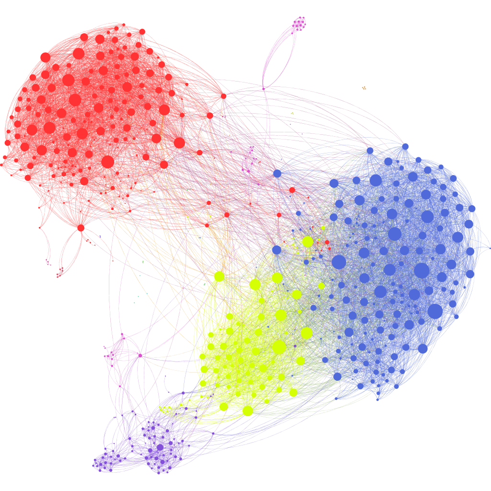

# data-structures-and-algorithms
Implementations of widely-useful data structures and algorithms. Will be building this repo overtime, both in number of structures and languages of implementation.

Feel free to use any of my code, for any purposes!

